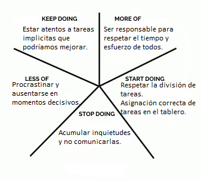

# RETROSPECTIVAS

## Retrospectiva, SPRINT 1

En nuestra primera retrospectiva llegamos a las siguientes conclusiones sobre nuestro primer sprint:

KEEP DOING: Consideramos que desde el primer momento tuvimos un gran respeto por la opinión del otro y siempre consultamos cada detalle del trabajo evitando futuros malentendidos.

MORE OF: Creemos que es muy importante mantener una comunicación constante, es por eso que planteamos reforzar la comunicación por Whatsapp (Nuestro medio principal de comunicación) y contar con el otro, participar y ayudar.

START DOING: Nuevamente hacemos hincapie en la comunicación como equipo y propusimos prender la cámara en cada reunión/daily para poder tener encuentros más cercanos y demostrar el compromiso de cada uno.

STOP DOING: Decidimos dos puntos principales, ignorar los mensajes del grupo para evitar repetir errores y no actualizar el tablero de jira ya que es tan importante como cualquier otro punto de este proyecto.

LESS OF: No respetar lo establecido desde un principio siempre y cuando esta instancia no tenga por motivo la mejora de experiencia del usuario o del proyecto en general.

## Retrospectiva, SPRINT 2

Segunda retrospectiva referida al sprint 2:

SEGUIR HACIENDO: En el primer sprint decidimos encender las cámaras en cada uno de los encuentros que tenemos y creemos que hay que seguir haciendolo ya que es algo fundamental para la comucación y demuestra el interés en el trabajo de cada uno.
Hacer una daily diaria de lunes a viernes que es algo que nos mantiene comunicados y al tanto del progreso de los compañeros.

HACER MÁS: Debemos mejorar en el prestar mas atención al progreso del trabajo, saber en que estado esta y actualizar el jira, tambien debemos mejorar la comunicación por whatsapp.
Otro punto que hay que mejorar es cumplir lo establecido en el sprint anterior, volver a leerlo para tenerlo presente y ponerlo en práctica lo ya pactado.

HACER MENOS: Dejar pasar los problemas y no hablarlos cuando tenemos algo importante que decir que comprometa el progreso del trabajo. 

EMPEZAR A HACER: Respetar el tiempo y el esfuerzo de los compañeros siendo responsable.
Prestar mas atención a los detalles del trabajo y agregar personalidad, para que el trabajo no sea básico, si no que pueda mejorar en detalles que incluso no están especificados en el sprint.

DEJAR DE HACER: Ser impuntual en los horarios pactados en los encuentros. 
No avisar cuando hay un bloqueo que impide avanzar con el trabajo.

## Retrospectiva, SPRINT 3

En nuestra tercera retrospectiva llegamos a las siguientes conclusiones sobre nuestro tercer sprint:

KEEP DOING: Estar atentos a los detalles que no necesariamente sean obligatorios en el sprint pero que puedan ayudar a mejorar el proyecto en algún aspecto. Consideramos que deberíamos hcaer de este punto una costumbre para que el trabajo que realicemos sea más genuino.

MORE OF: Es muy importante ser responsable para respetar el tiempo y el esfuerzo de cada integrante, por eso insistimos en reforzar este punto para mantener un ambiente ordenado y cooperativo.

START DOING: Creemos que debemos respetar la división de tareas pactada desde un principio para que la carga de trabajo sea más equitativa y justa para todos, entendiendo como excepción aquellas situaciones en las que un compañero no pueda realizar su tarea por cuestiones de fuerza mayor. Además, en el tablero del Jira deberán estar asignadas como responsables de las tareas aquellas personas que realmente las hayan realizado.

STOP DOING: Acumular inquietudes y no comunicarlas. Para evitar situaciones limites, donde los conflictos pueden pesar más de lo que deberían, entendemos que es sumamente necesario expresarnos, escuchar y ser escuchados.

LESS OF: Procrastinar y, con ello, comprometer el proyecto y al resto del equipo. También queremos evitar que cualquier integrante se ausente en momentos decisivos del sprint tales como reuniones organizativas o entregas.